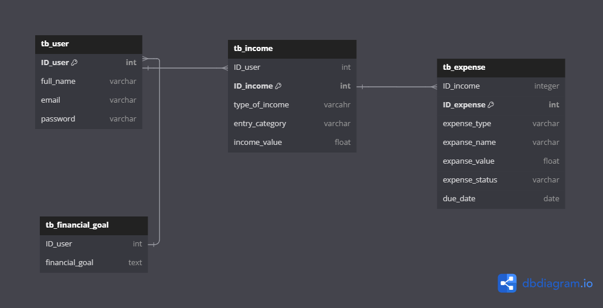

# Gestão financeira pessoal

## Problema:
>  Quando não temos um entendimento claro de nossas finanças pessoais, estamos navegando às cegas em um mar de incertezas financeiras. Isso pode levar a gastos excessivos, endividamento, falta de planejamento para o futuro e até mesmo dificuldades em alcançar nossos objetivos financeiros.

> Sem saber para onde nosso dinheiro está indo, é difícil controlar nossos gastos e priorizar aquilo que realmente importa. Muitas vezes, acabamos gastando impulsivamente em coisas que não agregam valor às nossas vidas, enquanto negligenciamos áreas importantes, como economizar para emergências, investir para o futuro ou pagar dívidas acumuladas.

## Solução:

>   Desenvolver um banco de dados para registrar finanças pessoais é uma solução poderosa para ajudar as pessoas a gerenciarem melhor seu dinheiro e a tomarem decisões financeiras mais informadas. Esse tipo de sistema oferece uma plataforma centralizada para armazenar e organizar informações sobre receitas, despesas, investimentos e outros aspectos financeiros, proporcionando uma visão holística da situação financeira de um indivíduo.

> Com um banco de dados dedicado, os usuários podem registrar todas as suas transações financeiras de forma sistemática e categorizá-las de acordo com suas preferências. Isso permite uma análise detalhada dos padrões de gastos ao longo do tempo, identificando áreas onde é possível economizar ou otimizar recursos.

